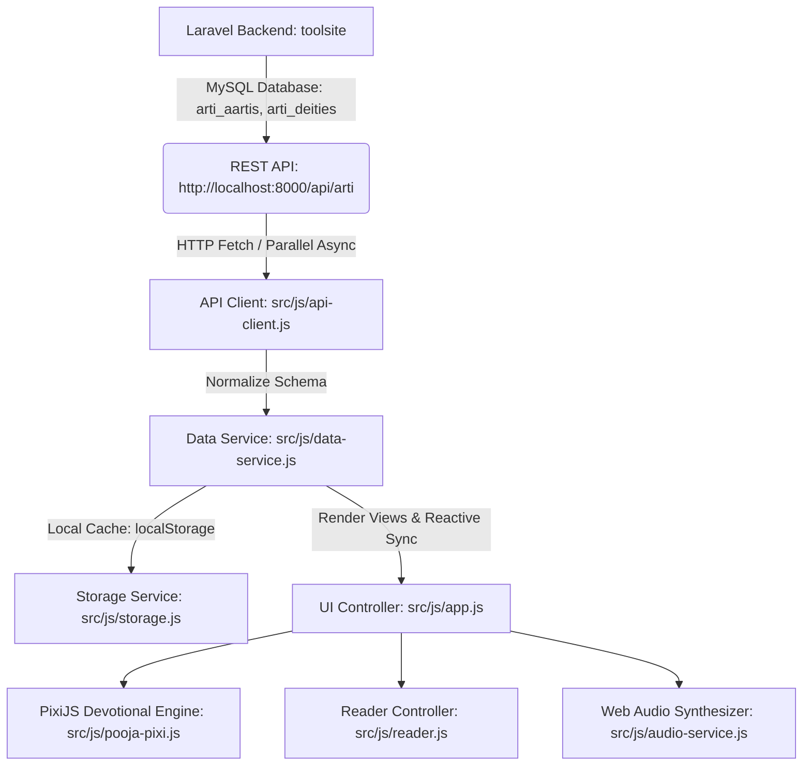

# Aarti Sangrah (आरती संग्रह) — Project Documentation & AI Knowledge Base

> **CRITICAL INSTRUCTION FOR ALL AI ASSISTANTS:**
> This document is the **single living source of truth** for this project.
> 1. Always refer to this document before making architectural decisions or modifying data structures.
> 2. Whenever you introduce new features, alter endpoints, change database schemas, or update data counts, you **MUST update this file** in the same turn.

---

## 1. Project Overview & Vision

**आरती संग्रह (Sacred Aarti Sangrah)** is a high-performance, mobile-first devotional web application designed for sacred Hindu daily rituals, Aarti singing, and temple contemplation.

- **Theme & Aesthetics**: Sacred Indian temple design with gold accents (`#FF9933`, `#D4AF37`), dark temple night mode, ivory and parchment themes, Devanagari typography, and floating diya lamp glassmorphism.
- **Interactive Pooja Engine**: Built with **PixiJS v8** (`src/js/pooja-pixi.js`), offering interactive flower showers (marigold, rose petals), virtual brass temple bell ringing, burning diya flame animation, and sacred shankh (conch) sound synthesis via Web Audio API.
- **Reader Experience**:
  - Structured stanzas (chorus, verses, doha, chalisa)
  - Auto-scroll with adjustable speed (1x to 5x)
  - Text resizing (16px to 32px)
  - Script toggle (Devanagari / Roman Transliteration)
  - Offline favorites and reading history

---

## 2. System Architecture & Tech Stack



### Tech Stack Details:
- **Frontend Core**: Vanilla JavaScript (ES modules), Vanilla CSS3 (`src/css/main.css`). No heavy front-end frameworks.
- **Graphic / Animation Engine**: PixiJS v8 (`pixi.js` 8.16.0).
- **Bundler & Dev Server**: Vite 8 (`npm run dev`, `npm run build`, `npx vite preview --port 5173`).
- **Backend API**: Laravel REST API located at `d:\SOFTWARES\xampp82new\htdocs\toolsite` running via `php artisan serve` on port 8000.
- **Database**: MySQL database (`toolsite`) managed by Laravel Eloquent models and migrations.

---

## 3. Data Flow & Single Source of Truth (API-Only)

> [!IMPORTANT]
> **Strict API Data Policy**:
> - The application **strictly uses data originating from the API** (`http://localhost:8000/api/arti`).
> - **Zero bundled fallback JSON**: No mock or static JSON files are bundled as working runtime data.
> - **Zero dummy aartis**: All placeholder/mock aartis created at early stages have been permanently purged. Only authentic extracted aartis exist.

### API Endpoints
Base URL: `http://localhost:8000/api/arti` (Configurable via `window.APP_CONFIG.API_BASE_URL` or fallback).

| Method | Endpoint | Description |
|---|---|---|
| `GET` | `/deities` | Returns list of active deities/categories with sacred metadata |
| `GET` | `/aartis` | Returns all authentic aartis with lyrics, timings, and deity info |
| `GET` | `/aartis/{id_or_slug}` | Fetches individual aarti by ID or slug |
| `GET` | `/deities/{id_or_slug}/aartis` | Fetches aartis under a specific deity |
| `GET` | `/popular` | Returns popular aartis collection |

### Local Persistence & Offline Sync Engine
1. **First Launch (Cold Boot)**:
   `DataService.loadData()` awaits the live API fetch. Once received, it normalizes and displays the data, while saving a copy to `localStorage` via `StorageService`.
2. **Subsequent Launches (Warm Boot / Offline)**:
   Immediately renders from cached API data (`storageService.getCachedAartis()`, `storageService.getCachedDeities()`) for instantaneous 0ms startup.
3. **Background SWR Synchronization**:
   Silent background fetch to the Laravel API updates cache in real-time. If fresh data or modifications are found, reactive event listeners notify the UI to refresh views.
4. **Header Sync Indicator**:
   - Status Pill: Displays `● लाइव API (61)` when synced with backend, or `● ऑफ़लाइन (61)` when network is disconnected.
   - Force Sync Button (`🔄`): Allows users to manually force re-synchronization with live rotation animation and feedback toasts.

---

## 4. Current Dataset Inventory

- **Total Authentic Aartis**: **61** (Extracted directly from Webdunia Hindi Dharma Aarti collection).
- **Total Active Deities / Categories**: **13**.

### Deity Categories Breakdown:
| Category ID | Devanagari Name | English Name | Aarti Count | Key Deities Included |
|---|---|---|---|---|
| `durga` | माँ दुर्गा | Durga Mata | 16 | Navratri 9 forms (Shailputri, Brahmacharini, Chandraghanta, Kushmanda, Skandamata, Katyayani, Kalaratri, Mahagauri, Siddhidatri), Jag Janani, Ambe Gauri |
| `special` | व्रत एवं विशिष्ट आरतियां | Vrat & Special | 9 | Chhath, Karwa Chauth, Tulsi, Gaumata, Dhanvantari, Kuber, Yamraj, Chitragupt, Mahavir Swami |
| `ganesh` | श्री गणेश | Shri Ganesh | 8 | Sukh Karta Dukh Harta, Jai Mangal Murti, Shendur Lal Chadhayo, Ganesh Chalisa |
| `hanuman` | श्री हनुमान | Hanuman Ji | 5 | Aarti Kije Hanuman Lala Ki, Hanuman Chalisa, Tuesday Aarti, Vichitra Veer Maruti Stotram, Panchmukhi |
| `lakshmi` | माँ लक्ष्मी | Lakshmi Mata | 5 | Om Jai Lakshmi Mata, Diwali Mahalakshmi, Lakshmi Narasimha Stotram |
| `vishnu` | श्री सत्यनारायण / विष्णु | Shri Vishnu | 4 | Om Jai Jagdish Hare, Satyanarayan, Lakshminarayana, Narsimha Chalisa |
| `shiva` | भगवान शिव | Shiv Ji | 3 | Om Jai Shiv Omkara, Har Har Mahadev, Jai Gangadhar Har Shiv |
| `shyam` | बाबा खाटू श्याम | Khatu Shyam Baba | 3 | Baba Khatu Shyam Aarti, Khatu Shyam Stuti |
| `ganga` | माँ गंगा मैया | Ganga Maiya | 3 | Ganga Aarti, Jai Surasari Maiya |
| `krishna` | श्री कृष्ण | Shri Krishna | 2 | Aarti Kunj Bihari Ki, Janmashtami Special Aarti |
| `kuber` | भगवान श्री कुबेर | Kuber Dev | 1 | Kuber Ji Ki Aarti |
| `saraswati` | माँ सरस्वती | Saraswati Mata | 1 | Om Jai Saraswati Mata (Vasant Panchami) |
| `surya` | सूर्य देव एवं गायत्री मंत्र | Surya Dev | 1 | Om Jai Surya Bhagwan, Dinakar Bhagwan |

*(Note: Legacy empty categories `ram` and `saibaba` were dropped as they had no authentic extracted entries).*

---

## 5. Asset & Image Management

> [!NOTE]
> **No Third-Party External Image CDNs**:
> All images are stored locally to guarantee offline resilience and avoid external CORS or CDN breakage.

1. **Frontend App Images**:
   Path: `d:\SOFTWARES\xampp82new\htdocs\androidapps\arti\public\assets\images\arties\`
   Served as static assets by Vite at `/assets/images/arties/<slug>.jpg`.
2. **Backend API Images**:
   Path: `d:\SOFTWARES\xampp82new\htdocs\toolsite\public\images\arties\`
   Served by Laravel at `http://localhost:8000/images/arties/<slug>.jpg`.
3. **Image Normalization in API Client**:
   If the API provides an absolute `image_url`, it is used directly; otherwise it cleanly resolves to the local `/assets/images/arties/` fallback.

---

## 6. Directory Structure & Key Files

```
d:\SOFTWARES\xampp82new\htdocs\androidapps\arti/
├── .agents/
│   └── AGENTS.md                  # Workspace AI instructions (points to PROJECT_INFO.md)
├── PROJECT_INFO.md                # THIS LIVING KNOWLEDGE BASE FILE
├── index.html                     # Main application entry HTML (Header, Tabs, Reader modal, Pixi Canvas)
├── package.json                   # Dependencies (pixi.js, vite)
├── public/
│   └── assets/images/arties/      # 60+ local devotional JPG images
├── src/
│   ├── css/
│   │   └── main.css               # Comprehensive styles (Sacred Theme, Typography, Animations)
│   ├── js/
│   │   ├── api-client.js          # REST API communication engine (timeout, normalization)
│   │   ├── app.js                 # App router, event handling, view rendering, sync monitoring
│   │   ├── audio-service.js       # Synthesized Web Audio API bells and shankh sounds
│   │   ├── data-service.js        # API-first SWR data layer, search, category re-computation
│   │   ├── pooja-pixi.js          # PixiJS v8 flower showers, diya particle engine, brass bell
│   │   ├── reader.js              # Full-screen Aarti reader, auto-scroll, theme switches
│   │   └── storage.js             # LocalStorage manager (offline cache, favorites, recents, settings)
│   └── assets/data/
│       ├── arties.json            # Reference copy of 61 authentic aartis (used by seeder)
│       └── categories.json        # Reference copy of 13 categories (used by seeder)
└── scripts/
    ├── remove_dummy_arties.py     # Cleanly strips dummy items from datasets
    ├── create_seeder.py           # Updates Laravel's ArtiDatabaseSeeder.php
    ├── create_migration.py        # Generates Laravel database migrations for arti tables
    ├── fix_models.py              # Updates Laravel Eloquent models (Aarti, Deity)
    ├── download_images_locally.py # Scrapes and downloads all images locally
    └── scrape_webdunia_v2.py      # Webdunia scraping pipeline
```

---

## 7. Backend Integration (`toolsite`)

- **Root Location**: `d:\SOFTWARES\xampp82new\htdocs\toolsite`
- **Models**:
  - `app/Models/Arti/Aarti.php`: Casts `lyrics_json` and `lyrics_transliteration` to `array`, relationships to `Deity`.
  - `app/Models/Arti/Deity.php`: HasMany `aartis`.
- **Seeder**:
  - `database/seeders/ArtiDatabaseSeeder.php`: Reads `arties.json` and `categories.json` from the `arti` app directory, purges dummy records, and seeds the MySQL database.
  - To re-seed:
    ```bash
    php D:\SOFTWARES\xampp82new\htdocs\toolsite\artisan db:seed --class=ArtiDatabaseSeeder
    ```
- **Serve Command**:
  ```bash
  php artisan serve --host=127.0.0.1 --port=8000
  ```

---

## 8. Guidelines for AI Assistants Modifying This Codebase

1. **Always Keep API as Source of Truth**:
   Never re-introduce bundled mock/dummy datasets into `src/js/data-service.js`. Keep the app pure API-driven with `storage.js` offline cache.
2. **Never Add Dummy/Placeholder Aartis**:
   Any new Aartis must be authentic devotional hymns with verified Devanagari lyrics and appropriate deity categorization.
3. **Keep Counts Consistent**:
   If adding or deleting Aartis, re-run the seeder on `toolsite` and update both the database and the reference JSON files in `src/assets/data/`.
4. **Update This File**:
   Whenever you alter endpoints, add features, change schemas, or touch the pipeline, update `PROJECT_INFO.md`.
