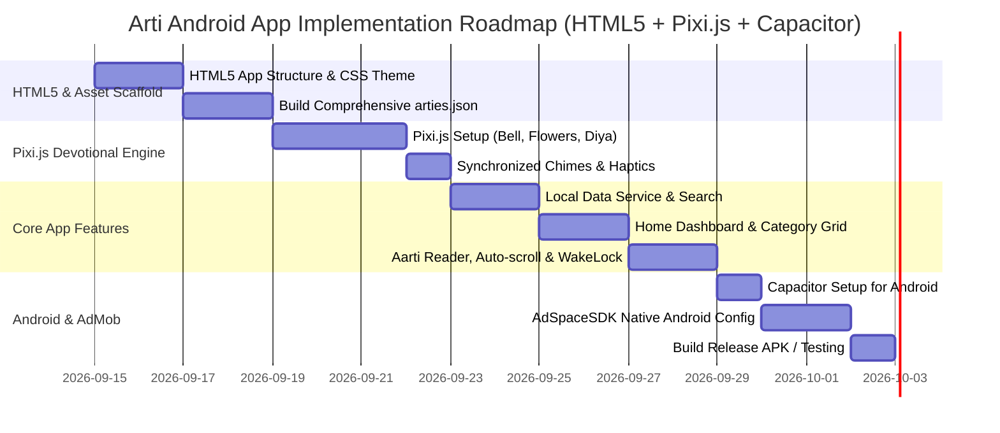

# Software Requirements Specification (SRS) & UI/UX Design Plan
## Arti Android Application (Ionic + Capacitor)
### Architecture: Option 1 — 100% Bundled Local Data (No API) + AdMob Integration

---

## 1. Executive Summary & Architecture Decision

### 1.1 Project Overview
The **Arti Android Application** is a high-performance, offline-first mobile app built with the **Ionic Framework** and **Capacitor**, designed to give devotees an enchanting, serene, and intuitive experience reading sacred Hindu prayers, hymns, and Aartis (Ganesh, Shiva, Hanuman, Durga, Lakshmi, Vishnu, Krishna, Ram, etc.).

### 1.2 Architecture Selection: Option 1 (Zero API / 100% Bundled Local Storage)
In accordance with your specification:
- **No external API dependency**: The app does **not** rely on external network requests or 3rd-party servers to load Aartis.
- **Instantaneous 0ms Launch**: All Aartis, categories, metadata, and lyrics are bundled directly within the app's assets (`assets/data/arties.json` and `assets/data/categories.json`).
- **100% Offline by Default**: Functions anywhere — including temple sanctums, rural areas, or airplane mode.
- **Zero Server Costs**: No database hosting, maintenance, or risk of API downtime.
- **User Preferences & Bookmarks**: Stored locally on the device using `@capacitor/preferences` (survives app restarts and updates).

---

## 2. Target Audience & Core Use Cases

| User Persona | Context / Need | Solution in Option 1 |
| :--- | :--- | :--- |
| **Daily Devotee** | Recites Aartis during morning/evening Pooja in front of a home altar or temple. | Instant launch, one-tap favorites, hands-free auto-scroll, screen keep-awake (no screen turn-off during prayer). |
| **Festival Devotee** | Searches for specific Aartis during festivals (Diwali, Navratri, Ganesh Chaturthi, Shivratri). | Fast offline search by Deity/Festival, categorized lists, Hindi & Marathi Devanagari lyrics with English transliteration. |
| **Devotees in Temples** | Reciting inside temples with poor or zero network coverage. | 100% offline data bundled in app assets. |
| **Senior Citizens** | May struggle with small fonts, low contrast, or complex mobile navigation. | High-contrast devotional theme, customizable font sizes (A- / A+), clean single-screen reader. |

---

## 3. Product Features & Functional Requirements

### 3.1 Data Architecture (Bundled Assets)
The app includes a verified, pre-packaged dataset:
- `assets/data/categories.json`: List of deities with icons, colors, day-of-week associations, and titles.
- `assets/data/arties.json`: Complete Aarti lyrics formatted with stanzas, choruses, and transliterations.

#### Included Popular Aartis in Starter Bundle:
1. **Shri Ganesh**: *Sukh Karta Dukh Harta*, *Shendur Lal Chadhayo*, *Jai Ganesh Deva*
2. **Shri Shiva**: *Om Jai Shiv Omkara*, *Lavkathati Sangati*
3. **Shri Hanuman**: *Aarti Kije Hanuman Lala Ki*, *Hanuman Chalisa*, *Maruti Stotra*
4. **Mata Durga / Ambe**: *Jai Ambe Gauri*, *Durge Durgat Bhari*
5. **Mata Lakshmi**: *Om Jai Laxmi Mata*
6. **Shri Vishnu / Satyanarayan**: *Om Jai Jagdish Hare*
7. **Shri Krishna**: *Aarti Kunj Bihari Ki*
8. **Shri Ram**: *Shri Ramachandra Kripalu Bhajuman*
9. **Shri Sai Baba**: *Aarti Sai Baba*, *Kakad Aarti*
10. **Mata Saraswati**: *Jai Saraswati Mata*
11. **Surya Dev & Gayatri Mantra**

### 3.2 Key Application Modules

#### A. Home / Dashboard Screen
- **Today's Recommended Aarti**: Dynamically highlights deities based on the day of the week (e.g., Monday: Shiva, Tuesday: Ganesh & Hanuman, Friday: Lakshmi & Durga).
- **Deity & Category Grid**: Visual cards with deity artwork and Aarti count.
- **Favorites / Daily Pooja Tray**: Quick horizontal carousel of user-pinned Aartis for daily pooja.
- **Recently Read List**: Instant access to the last 5 viewed Aartis.

#### B. Search & Filter
- **Real-Time Offline Search**: Filter by title (in both Devanagari script and English transliteration, e.g., "Sukh Karta" or "सुखकर्ता").
- **Fast Filter Chips**: By Deity, Day of the Week, and Language.

#### C. Aarti Reader Screen (The Core Experience)
- **Sacred Reading Canvas**: Clean, distraction-free view with parchment/cream background or dark prayer mode.
- **Devanagari Typography**: Beautiful rendering using Google Fonts (*Tiro Devanagari*, *Noto Sans Devanagari*).
- **Hands-Free Auto-Scroll Engine**:
  - Auto-scrolling with adjustable speed (+ / - / Pause) so users can hold the Pooja Thali / bell while singing.
- **Reader Controls Bar (Floating bottom toolbar)**:
  - **Font Resizer**: Dynamic buttons (Small, Medium, Large, Extra Large).
  - **Theme Switcher**: Day Mode (Warm Ivory/Gold), Night Mode (Deep Temple Slate), Sepia (Parchment).
  - **Keep Screen Awake (WakeLock)**: Prevents phone sleep while reading.
  - **Bell & Shankh Sound Effects**: Interactive bell chime for pooja atmosphere.
- **Bookmark / Favorite Button**: Instant toggle with haptic feedback.
- **Share**: One-click share formatted lyrics to WhatsApp / Family groups.

---

## 4. UI/UX Design System & Theme Plan

### 4.1 Spiritual Aesthetic Philosophy
The visual identity is crafted to feel **divine, serene, modern, and respectful**, avoiding gaudy or cluttered designs in favor of warm, tranquil temple aesthetics.

### 4.2 Color Palette
```
Primary Temple Gold:  #D4AF37  /* Sacred Gold Accent */
Deep Saffron / Amber: #E65100  /* Auspicious Saffron */
Temple Maroon / Red:  #880E4F  /* Auspicious Kumkum */
Diya Flame Glow:      #FFA000  /* Warm Accent */

Background Light:     #FDFBF7  /* Sacred Warm Ivory / Parchment */
Surface Card Light:   #FFFFFF  /* Crisp elevated card */
Text Primary Light:   #2D1F17  /* Deep Earthy Charcoal */
Text Secondary Light: #795548  /* Sandalwood Brown */

Background Dark:      #12100E  /* Deep Temple Night */
Surface Card Dark:    #1E1A16  /* Dark Sandalwood Card */
Text Primary Dark:    #F5EBE1  /* Warm Off-White */
Text Secondary Dark:  #BCAAA4  /* Muted Gold Khaki */
```

### 4.3 Typography Hierarchy
- **Primary Devanagari Font**: `Tiro Devanagari Hindi` / `Noto Sans Devanagari`
- **Headings & Titles**: `Rozha One` / `Poppins` (Bold, 20px - 26px)
- **Aarti Lyrics**: 18px - 24px (scalable up to 34px), Line Height 1.8 for effortless chanting.
- **Micro-copy & Captions**: `Inter` / `Poppins` (12px - 14px)

### 4.4 Interactive Virtual Pooja Experience with Pixi.js (WebGL Engine)
To elevate the app from a basic reader into a truly mesmerizing, divine experience, we incorporate **Pixi.js (v8)** for lightweight, hardware-accelerated 2D devotional animations.

#### A. Interactive Pixi.js Devotional Modules:
1. **Interactive Brass Temple Bell (घंटी)**:
   - Rendered at the top header of the reader or floating corner.
   - Tapping or dragging swings the bell with natural pendulum physics, emitting synchronized brass chime audio, particle sparkles, and gentle haptic vibration.
2. **Flower Shower Offering (पुष्प वृष्टि - Pushpa Vrishti)**:
   - A dedicated "Offer Flowers" (फूल चढ़ाएं) action button.
   - Spawns a cascade of realistic rose and marigold flower petals tumbling gracefully with 2D gravity physics across the deity portrait.
3. **Sacred Diya (दीप दर्शन) with Flickering Flame**:
   - Golden oil lamp with animated flame particles that glow warmly.
4. **Divine Halo / Aura (दिव्य प्रभा मंडल)**:
   - Soft, rotating radiant golden halo behind deity images on the Home banner and Reader header.
5. **Dhoop / Incense Smoke Particles**:
   - Gentle, tranquil curling incense smoke rising gracefully in the background.

#### B. Battery-Conscious Hybrid Architecture:
- **Lyrics Reading**: Kept in native HTML/CSS DOM for crisp Devanagari typography, dynamic font scaling (A- / A+), and zero battery drain during prolonged reading.
- **Pixi.js On-Demand Canvas**:
  - WebGL ticker runs **on-demand** (animates during flower showers or bell ringing, then gracefully enters low-power idle mode).
  - Ticker pauses automatically when user scrolls deep into the lyrics or app is in background.

---

## 5. AdMob Monetization Architecture & Integration Plan

### 5.1 Devotional-First Ad Strategy (Respectful Monetization)
In a prayer/devotional app, intrusive ads ruin the sacred experience and lead to uninstalls. We implement a **high-converting yet respectful ad strategy**:
1. **No Ads During Prayer**: The **Aarti Reader screen is 100% ad-free**. No banners, no popups while reciting.
2. **Smart Banner Ads**: Anchored at the bottom of the **Home** and **Category List** screens only.
3. **Frequency-Capped Interstitials**:
   - Shown only when returning back to the home screen after completing a reading.
   - Frequency capped (e.g., maximum once every 3 to 4 Aartis read, and minimum 60 seconds interval).
4. **App Open Ad (Optional)**: Shown on cold app launches (with frequency cap, maximum once every 4 hours).
5. **GDPR / UMP CMP Consent**: Full automated consent compliance for European and global traffic.

### 5.2 AdSpaceSDK Integration (Native Android Layer)
Following the AdSpaceSDK specification:
- **Maven Dependency**: `io.github.maichanchinh:adspace-admob:2.0.+`
- **Package Name**: `com.admob.adspace`
- **Min SDK**: Android 26 (API 26+)
- **Java/Kotlin**: Java 21, JVM target 21

#### Step 1: `build.gradle.kts` (App Module)
```kotlin
dependencies {
    implementation("io.github.maichanchinh:adspace-admob:2.0.+")
}
```

#### Step 2: `AndroidManifest.xml`
```xml
<manifest>
    <application
        android:name=".ArtiApplication"
        ...>
        <!-- Google AdMob App ID -->
        <meta-data
            android:name="com.google.android.gms.ads.APPLICATION_ID"
            android:value="ca-app-pub-3940256099942544~3347511713"/> <!-- Test ID -->
    </application>
</manifest>
```

#### Step 3: Local Ad Configuration (`assets/ads_config.json`)
```json
{
  "ads": {
    "global": {
      "enable": true,
      "cmp_auto": true,
      "min_interval": 60000
    },
    "spaces": [
      {
        "space": "ADMOB_Banner_Home",
        "adsType": "banner",
        "ids": ["ca-app-pub-3940256099942544/6300978111"],
        "enable": true,
        "minInterval": 30000
      },
      {
        "space": "ADMOB_Interstitial_Exit_Reader",
        "adsType": "interstitial",
        "ids": ["ca-app-pub-3940256099942544/1033173712"],
        "enable": true,
        "minInterval": 60000
      },
      {
        "space": "ADMOB_AppOpen_Launch",
        "adsType": "app_open",
        "ids": ["ca-app-pub-3940256099942544/9257395921"],
        "enable": true,
        "minInterval": 14400000
      }
    ]
  }
}
```

#### Step 4: Application Initialization (`ArtiApplication.kt`)
```kotlin
package com.onlinetxttools.arti

import android.app.Application
import com.admob.adspace.AdSpaceSDK
import com.admob.adspace.AdSpaceSDKConfig

class ArtiApplication : Application() {
    override fun onCreate() {
        super.onCreate()
        
        val config = AdSpaceSDKConfig(
            debug = BuildConfig.DEBUG,
            testDevices = emptyList(),
            minInterval = 60L,
            appId = "ca-app-pub-3940256099942544~3347511713"
        )
        
        AdSpaceSDK.initialize(this, config)
    }
}
```

#### Step 5: Native Capacitor Ad Bridge
A lightweight Capacitor plugin connects Ionic TypeScript events with native AdSpaceSDK:
```typescript
// Ionic / TypeScript Service
import { AdBridge } from './services/ad-bridge.service';

// Show Banner on Home Page
AdBridge.showBanner('ADMOB_Banner_Home');

// Hide Banner when entering Reader
AdBridge.hideBanner();

// Trigger Interstitial after finishing reading (respects frequency cap)
AdBridge.showInterstitialIfReady('ADMOB_Interstitial_Exit_Reader');
```

---

## 6. Technology Stack & Dependencies

| Layer | Technology | Purpose |
| :--- | :--- | :--- |
| **Core Architecture** | **HTML5 + Modern Vanilla JavaScript (ES Modules)** | Ultra-fast load times, zero framework overhead, seamless native DOM control |
| **Styling & UI** | **Vanilla CSS3 (Spiritual Devotional Design System)** | CSS Grid, Flexbox, custom variables, smooth transitions, mobile-first responsive |
| **Interactive 2D Canvas** | **Pixi.js (v8)** | Hardware-accelerated temple bell, flower shower, and diya flame animations |
| **Native Android Runtime** | **Capacitor 6** | Native Android container, APK/AAB compilation, native plugin access |
| **Ad Monetization** | **AdSpaceSDK** (`com.admob.adspace:2.0.+`) | Google AdMob Next-Gen wrapper with automated CMP consent & frequency capping |
| **Screen WakeLock** | `@capacitor-community/keep-awake` | Keeps screen awake while reading during Pooja |
| **Local Storage** | `@capacitor/preferences` (or `localStorage`) | Persistent storage for favorites, recent history, and font size |
| **Haptics** | `@capacitor/haptics` | Subtle tactile vibration feedback |
| **Social Share** | `@capacitor/share` | Share Aarti lyrics to WhatsApp or other apps |

---

## 7. Implementation Roadmap & Milestones




